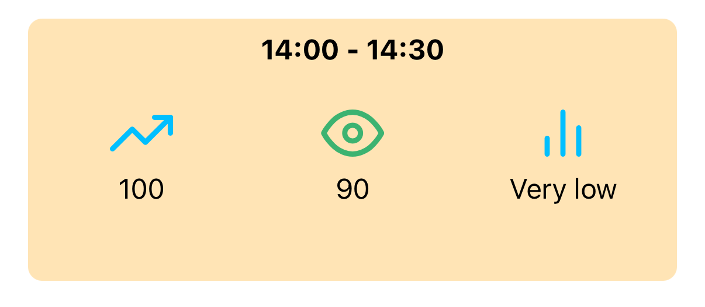
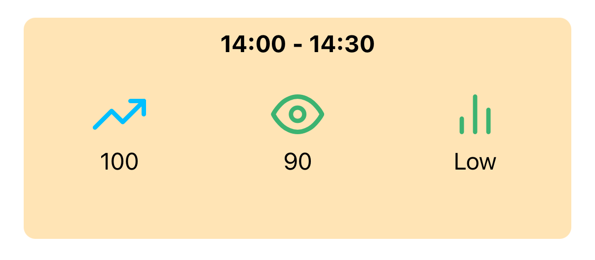
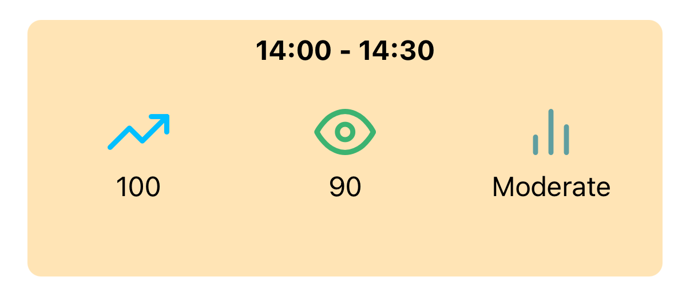
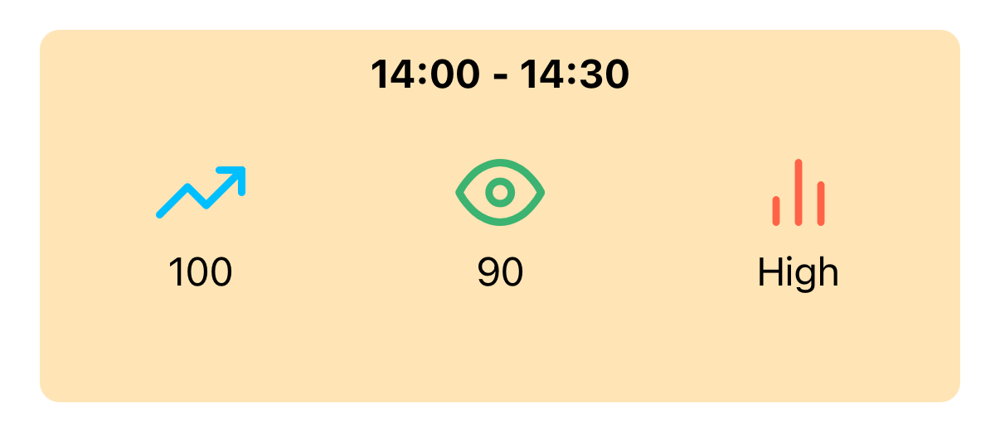
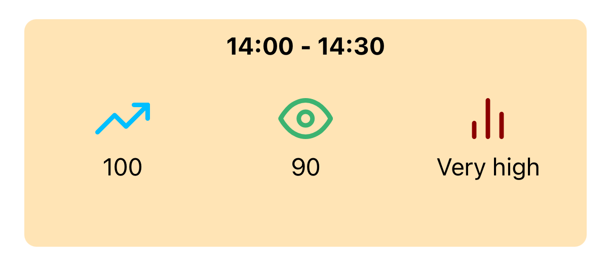

# Latus Group React Tech Test

This tech test is designed to assess your React
knowledge. You should spend no more than 2 hours on this task.

Fork this repo to get started, and send us an email with a link to your solution.

## The challenge

You've been asked to create a component to display data of the following
shape:

```json
{
  "data": [
    {      
      "from": "2018-01-20T12:00Z",
      "to": "2018-01-20T12:30Z",
      "intensity": {
        "forecast": 266,
        "actual": 263,
        "index": "moderate"
      }
    },
    {          
      "from": "2018-01-20T12:30Z",
      "to": "2018-01-20T13:00Z",
      "intensity": {
        "forecast": 267,
        "actual": 265,
        "index": "high"
      }
    },
    ...
  ]
}
```

The following designs have been provided for a single item from the array:







> [!NOTE]
> A `Card` component has already been created, and can be reused in your
> component.

> [!NOTE]
> The above example uses the `Feathers` icon set

### Must haves

- An item component that matches the designs
- A screen that displays any number of the above component
- Appropriate tests for any components created

### Nice to haves

- Appropriate stories for any components created

## Storybook

To run `Storybook`, run the appropriate script:

- `pnpm run storybook`


### Commands

- `pnpm run dev`: start Vite dev server at `http://localhost:5173`.
- `pnpm run build`: production build to `dist/`.
- `pnpm run preview`: preview the production build locally.

### Source layout

- Web entry: `index.html` and `web/main.tsx`
- Routing shell: `src/routes/WebApp.tsx`
- Routes: `src/routes/*`
- UI components: `src/ui/*`
- Styles: Vanilla CSS Modules alongside components/pages

### Notes

- React Router v7 is used with `createBrowserRouter` and nested routes.
- Vanilla CSS Modules provide locally-scoped styles (e.g. `Card.module.css`).
